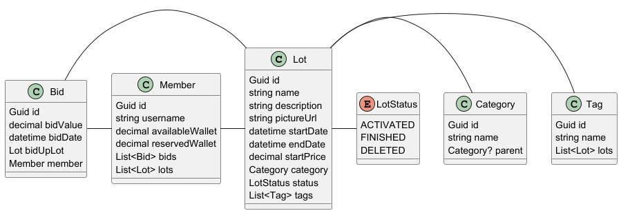

# Backend-LABEFE

## Description

This project is designed to facilitate online auctions where users can bid on various items in real time.

The main features are:

- User authentication and profile management, allowing users to securely log in, and manage their auction activity.
- Item listing system, enabling sellers to create detailed auction listings with picture, descriptions, and starting prices.
- Real-time bidding, allowing multiple users to place bids and see updates on the current highest offer.
- Auction timer and automatic winner selection, which closes the auction at the predefined time and notifies the winning bidder.

## Getting Started

### Prerequisites

List all dependencies and their version needed by the project as :

* DataBase Engine (S2)
* IDE used (IntelliJ)
* OS supported (Windows 10/11, Linux x64)
* Virtualization (.JDK, .JRE)

### Configuration

Currently, setup with H2, no configuration needed.

## Deployment

### On dev environment

After cloning this repository, run this command:

```
   mvn clean spring-boot:run
```

to retrieve the dependencies, compile and run the program for the first time.

```
  [...]
  2024-04-09T21:27:27.338+02:00  INFO 21340 --- [payroll] [           main] j.LocalContainerEntityManagerFactoryBean : Initialized JPA EntityManagerFactory for persistence unit 'default'
  2024-04-09T21:27:27.517+02:00  WARN 21340 --- [payroll] [           main] JpaBaseConfiguration$JpaWebConfiguration : spring.jpa.open-in-view is enabled by default. Therefore, database queries may be per
  formed during view rendering. Explicitly configure spring.jpa.open-in-view to disable this warning
  2024-04-09T21:27:27.752+02:00  INFO 21340 --- [payroll] [           main] o.s.b.w.embedded.tomcat.TomcatWebServer  : Tomcat started on port 8080 (http) with context path ''
  2024-04-09T21:27:27.760+02:00  INFO 21340 --- [payroll] [           main] ch.etmles.Backend.BackendApplication     : Started PayrollApplication in 2.972 seconds (process running for 3.247)
  2024-04-09T21:27:27.802+02:00  INFO 21340 --- [payroll] [           main] c.e.payroll.Repositories.LoadDatabase    : Preloading Employee{id=1, name='Bilbo Baggins', role='burglar'}
  2024-04-09T21:27:27.803+02:00  INFO 21340 --- [payroll] [           main] c.e.payroll.Repositories.LoadDatabase    : Preloading Employee{id=2, name='Frodo Baggins', role='thief'}
  [...]
```

Go to http://localhost:8080/swagger-ui/index.html to test the API.

### On integration environment

/

## Directory structure

```shell
├───Bid
│   ├───DTO
│   └───Exceptions
├───Lot
│   ├───DTO
│   └───Exceptions
├───LotCategory
│   ├───DTO
│   └───Exceptions
├───Member
│   ├───DTO
│   └───Exceptions
└───Tag
    ├───DTO
    └───Exceptions
```

## Docs

### Class diagram



### Use case diagram

<object data="docs/UseCaseDiagram.pdf" type="application/pdf">
    <embed src="docs/UseCaseDiagram.pdf">
        <p>This browser does not support PDFs. Please download the PDF to view it: <a href="http://yoursite.com/the.pdf">Download PDF</a>.</p>
    </embed>
</object>


## Collaborate

  * [How to commit](https://www.conventionalcommits.org/en/v1.0.0/)
  * [How to use your workflow](https://nvie.com/posts/a-successful-git-branching-model/)

## License

* [GPL3](LICENSE).

## Contact

Create an issue on this repository.
